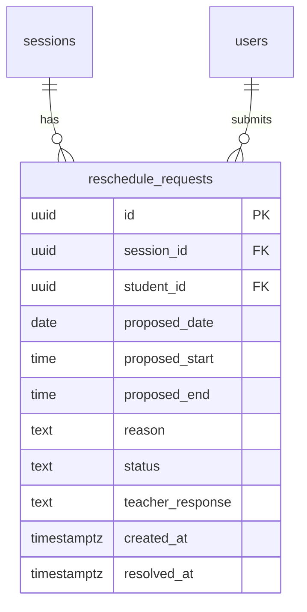
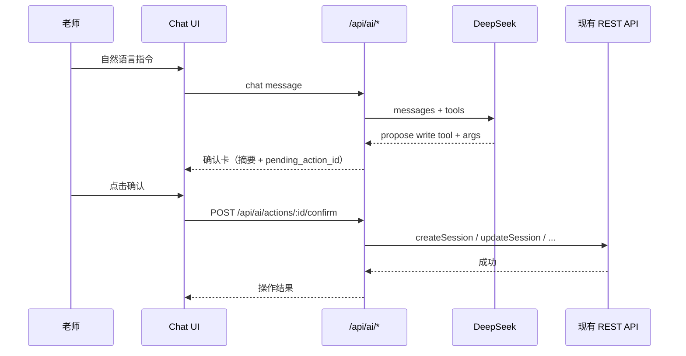
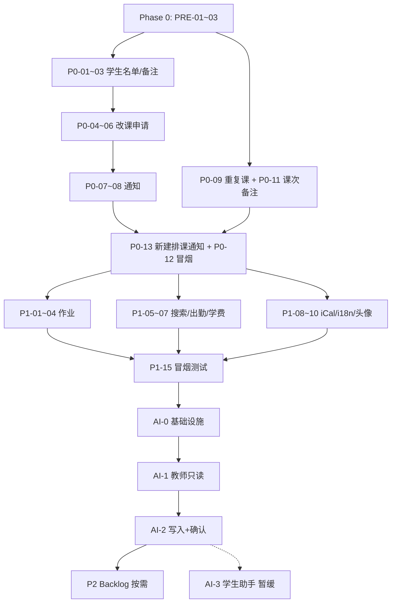

# EduSync 开发路线图 / Development Roadmap

> **用途 / Purpose：** P0、P1 可执行任务清单；P2 记入 backlog；预留 AI / Agent 扩展位。  
> **更新 / Updated：** 2026-06-16  
> **对照需求 / PRD ref：** `Project网站核心功能.pdf`（F1–F8）  
> **当前基线 / Baseline：** Auth ✅ · Google OAuth ✅ · 班级/日历 API ✅ · 生产部署 ✅

**怎么用这份文档 / How to use**

1. 按 **Phase → Task ID** 顺序做（有 `Depends on` 的先做依赖）。  
2. 每完成一项，把 `[ ]` 改成 `[x]`。  
3. P2 和 AI 部分**现在不做**，只作未来规划参考。

---

## 进度总览 / Progress Overview

| 阶段 Phase | 范围 Scope | 任务数 Tasks | 状态 Status |
|------------|------------|--------------|-------------|
| **Phase 0** | 当前 MVP 收尾（班级/日历小缺口） | 4 | ✅ 已完成 |
| **Phase 1 — P0** | 独立老师日常可用 | 13 | ✅ 已完成（邮件域名 ⏸️暂定） |
| **Phase 2 — P1** | 专业感 + PRD 补齐 | 15 | ✅ 已完成（P1-15 冒烟测试） |
| **Backlog — P2** | 差异化长期功能 | 8 | 📌 已记录 |
| **Phase 3 — AI** | 教师 Agent（DeepSeek） | 3 | 🔄 **当前：AI-1 ✅ → AI-2** |
| **Future — AI+** | 学生助手 / 自动化 | 3 | ⏸️ v1 不做 |

---

## Phase 0：MVP 收尾（建议先做，1–2 天）

与 P0 并行或略提前，把**已有后端、缺前端**的洞补上。

### P0-PRE-01 · 班级编辑与删除（前端接 API）

| | |
|--|--|
| **中文** | 老师在班级页可编辑名称/描述/计费、删除班级 |
| **English** | Wire class PATCH/DELETE on Classes page |
| **Depends on** | 无（`PATCH/DELETE /api/classes/:id` 已存在） |
| **Backend** | 无改动或仅错误文案 |
| **Frontend** | `ClassesPage.tsx`, `api.ts`（`updateClass`, `deleteClass`） |
| **Acceptance** | 老师可改班级信息；删除后列表刷新；学生已加入的班删除后 enrollment 级联清除 |
| **Estimate** | 0.5–1 天 |

- [x] `api.ts` 增加 `updateClass`, `deleteClass`
- [x] 班级卡片：Edit 对话框、Delete 确认
- [x] 手动测试老师账号（build ✅ · 生产 API PATCH/DELETE 返回 401 非 404）

---

### P0-PRE-02 · 课程编辑与取消（Sessions CRUD）

| | |
|--|--|
| **中文** | 老师可修改/删除已排课程 |
| **English** | Edit and cancel sessions |
| **Depends on** | 无 |
| **Backend** | 新增 `PATCH /api/sessions/:id`, `DELETE /api/sessions/:id`（`sessions.py`） |
| **Frontend** | `CalendarPage.tsx`, `api.ts` |
| **DB** | 已有 `sessions` 表 |
| **Acceptance** | 老师改时间/地点/标题；删除后日历与 Dashboard 同步更新 |
| **Estimate** | 1 天 |

- [x] 后端 PATCH/DELETE sessions
- [x] 日历日视图：编辑/删除入口
- [x] 权限：仅班级 teacher 可操作（`@require_role('teacher')` + `_teacher_owns_class`）

---

### P0-PRE-03 · 个人资料保存

| | |
|--|--|
| **中文** | Settings 里改显示名并保存到数据库 |
| **English** | Persist profile (display_name) |
| **Depends on** | 无 |
| **Backend** | `PATCH /api/users/me` 或扩展 `PATCH /api/users`（`users.py`） |
| **Frontend** | `SettingsPage.tsx`, `api.ts`, `AuthContext` 刷新 name |
| **Acceptance** | 保存后刷新页面名字仍在；401 时提示重新登录 |
| **Estimate** | 0.5 天 |

- [x] 后端 `PATCH /api/users/me` update display_name
- [x] 前端 Save 按钮启用并调 API + `AuthContext.updateUser`
- [ ] 可选：`grade`, `phone` 字段（为 F5 搜索铺路，**grade 已在 P1-05 实现**）

---

### P0-PRE-04 · 排课日期与时间（分钟级）+ 师生日历同步

| | |
|--|--|
| **中文** | 老师创建课次时必填日期、开始/结束时间（精确到分钟）；已加入班级的学生在 Calendar 与 Dashboard 同步看到 |
| **English** | Schedule sessions with date + minute-level times; show on teacher & student calendars |
| **Depends on** | P0-PRE-02（sessions CRUD 已有） |
| **Backend** | `POST/PATCH /api/sessions` 校验 `end_time > start_time`；时间统一存 `HH:MM:SS` |
| **Frontend** | `CalendarPage.tsx`（`type="date"` + `type="time" step=60`）；`Dashboard.tsx` 已有 upcoming 列表 |
| **DB** | 已有 `sessions.date`, `sessions.start_time`, `sessions.end_time` |
| **Acceptance** | 老师排 6/15 14:30–16:00 → 老师/学生 Calendar 该日可见；Dashboard「Upcoming」有记录；结束时间须晚于开始时间 |
| **Estimate** | 0.5–1 天 |
| **PRD** | F3 日历 / 排课 |

- [x] 后端 `POST/GET /api/sessions`（按 `class_enrollments` 过滤学生可见范围）
- [x] 前端 Calendar：Add Session 表单（日期 + 开始/结束时间）
- [x] 前端 Dashboard：师生 upcoming sessions 列表
- [x] 时间输入 `step=60`（分钟粒度）+ 前后端校验结束 &gt; 开始
- [x] 创建成功后日历跳转到排课日期并排序当日课次
- [x] 手动测试：老师排课 → 学生加入同班 → 两端 Calendar + Dashboard 均可见
- [x] 部署 Railway + Vercel 后生产验证

**下一步 / Next after this：** → **P0-02 学生管理总览页**

---

## Phase 1 — P0：独立老师「日常可用」

**目标 / Goal：** 老师能管学生、排课、处理改课、收到提醒 —— 不依赖作业/学费也能每天用。

**建议工期 / Suggested span：** 2–3 周（业余 2–3h/天）

---

### P0-01 · 班级学生名单

| | |
|--|--|
| **中文** | 老师查看每个班级里有哪些学生（姓名、邮箱、加入时间） |
| **English** | Class roster — list enrolled students per class |
| **Depends on** | P0-PRE-01（可选） |
| **Backend** | `GET /api/classes/:id/students` |
| **Frontend** | `ClassesPage` 展开/详情 或 `StudentsPage` 按班筛选 |
| **DB** | `class_enrollments` + `users` join |
| **Acceptance** | 老师点班级看到学生列表；学生看不到其他学生隐私列表 |
| **Estimate** | 1 天 |
| **PRD** | F2, F7 |

- [x] 后端 roster API + 仅 teacher 且 owns class
- [x] 前端学生列表 UI
- [x] 空状态：无人加入时提示分享班级码

**下一步 / Next after this：** → **P0-02 学生管理总览页**

---

### P0-02 · 学生管理总览页（Students）

| | |
|--|--|
| **中文** | 老师在一个页面看到所有学生（跨班级去重或分班级展示） |
| **English** | Teacher students hub |
| **Depends on** | P0-01 |
| **Backend** | `GET /api/students`（teacher 下所有 enrollment） |
| **Frontend** | 替换 `StudentsPage.tsx` 占位 |
| **Acceptance** | 显示学生数、所属班级；Add Student 可先保持「邀请码加入」说明 |
| **Estimate** | 1 天 |
| **PRD** | F2, F5（列表部分） |

- [x] 聚合 API
- [x] 表格或卡片列表
- [x] 点击学生 → 详情抽屉（班级列表）

**下一步 / Next after this：** → **P0-03 学生备注（私有）**

---

### P0-03 · 学生备注（私有）

| | |
|--|--|
| **中文** | 老师给每个学生写私有备注（水平、家长联系、学习目标） |
| **English** | Private teacher notes per student |
| **Depends on** | P0-02 |
| **Backend** | 新表 `student_notes` 或 `users` 扩展 `teacher_notes` JSON |
| **DB** | `student_notes(teacher_id, student_id, content, updated_at)` |
| **Frontend** | 学生详情侧栏 Textarea + 保存 |
| **Acceptance** | 仅备注的老师可见；学生不可见 |
| **Estimate** | 1 天 |

- [x] 迁移 SQL
- [x] CRUD API
- [x] UI 集成到 Students 详情

**下一步 / Next after this：** → **P0-04 改课申请 — 数据模型**

---

### P0-04 · 改课申请 — 数据模型

| | |
|--|--|
| **中文** | 学生可申请调整上课时间，须填理由 |
| **English** | Reschedule request data model |
| **Depends on** | P0-PRE-02 |
| **Backend** | 新表 `reschedule_requests` |
| **DB** | 字段建议：`session_id`, `student_id`, `proposed_date`, `proposed_start`, `proposed_end`, `reason`, `status`（pending/approved/rejected）, `teacher_response`, `created_at` |
| **Acceptance** | 表与 migration 在 Supabase 可执行 |
| **Estimate** | 0.5 天 |
| **PRD** | F3 |

- [x] `backend/sql/create_reschedule_requests.sql`
- [x] 文档内 ER 说明

**ER（改课申请）**

**下一步 / Next after this：** → **P0-05 改课申请 — 学生提交**

---

### P0-05 · 改课申请 — 学生提交

| | |
|--|--|
| **中文** | 学生在日历某节课上点「申请改时间」 |
| **English** | Student submits reschedule request |
| **Depends on** | P0-04 |
| **Backend** | `POST /api/reschedule-requests` |
| **Frontend** | `CalendarPage` 学生视图：Request 对话框 |
| **Acceptance** | 只能对自己的 session 申请；重复 pending 时提示 |
| **Estimate** | 1 天 |
| **PRD** | F3 |

- [x] 学生端 UI
- [x] 表单校验（理由必填、新时间合法）

**下一步 / Next after this：** → **P0-06 改课申请 — 老师审批**

---

### P0-06 · 改课申请 — 老师审批

| | |
|--|--|
| **中文** | 老师批准则更新 session 时间；拒绝则保留原时间并附回复 |
| **English** | Teacher approve/reject reschedule |
| **Depends on** | P0-05, P0-PRE-02 |
| **Backend** | `GET /api/reschedule-requests`, `PATCH .../approve`, `PATCH .../reject` |
| **Frontend** | 老师 Dashboard 或 Notifications 入口「待处理申请」 |
| **Acceptance** | 批准后日历自动更新；学生看到状态 |
| **Estimate** | 1.5 天 |
| **PRD** | F3 |

- [x] 审批列表 UI
- [x] 批准时写回 `sessions` 表
- [x] 触发通知（见 P0-07）

**下一步 / Next after this：** → **P0-07 站内通知系统（基础）**

---

### P0-07 · 站内通知系统（基础）

| | |
|--|--|
| **中文** | 课程变更、改课申请、审批结果 → 站内消息 |
| **English** | In-app notifications |
| **Depends on** | P0-06 |
| **Backend** | 表 `notifications`；创建通知的 helper；`GET /api/notifications`, `PATCH read` |
| **Frontend** | 替换 `NotificationsPage.tsx`；侧边栏未读角标（可选） |
| **DB** | `notifications(user_id, type, title, body, read, related_id, created_at)` |
| **Acceptance** | 排课变更/申请/审批后双方收到通知；可标已读 |
| **Estimate** | 2 天 |
| **PRD** | F6 |

- [x] 通知创建点：session update/delete, reschedule flow
- [x] 列表 + 空状态
- [x] `type` 枚举：`schedule_changed`, `reschedule_requested`, `reschedule_resolved`

**下一步 / Next after this：** → **P0-09 重复课程（每周固定）**（或先做 P0-11 课次备注）

---

### P0-08 · 课程变更时自动通知

| | |
|--|--|
| **中文** | 老师改/删课程时，该班学生自动收通知 |
| **English** | Auto-notify students on schedule change |
| **Depends on** | P0-07, P0-PRE-02 |
| **Backend** | 在 session PATCH/DELETE 后 bulk insert notifications |
| **Acceptance** | 学生 Notifications 页出现「XX 课已改为 …」 |
| **Estimate** | 0.5 天 |
| **PRD** | F3(2), F6 |

- [x] 后端 hook
- [x] 集成测试一条改课流程

---

### P0-09 · 重复课程（每周固定）

| | |
|--|--|
| **中文** | 老师排「每周一 9:00」重复课，自动生成多月 instances 或 RRULE |
| **English** | Recurring weekly sessions |
| **Depends on** | P0-PRE-02 |
| **Backend** | 扩展 `POST /api/sessions` 支持 `recurrence_rule`；或批量 insert |
| **Frontend** | 创建课程对话框：重复选项 |
| **DB** | 已有 `recurrence_rule`, `recurrence_group_id` |
| **Acceptance** | 选 8 周重复 → 日历显示 8 条；删除可选「仅本次/全部」 |
| **Estimate** | 2 天 |
| **PRD** | F3 |

- [x] 最小实现：每周重复 + 结束日期
- [x] 删除单条 vs 整组

**下一步 / Next after this：** → **P0-11 Session 老师备注**（或 P0-10 邮件提醒可选）

---

### P0-10 · 邮件提醒（可选，可后置）

| | |
|--|--|
| **中文** | 上课前 24 小时邮件提醒（Resend / SendGrid） |
| **English** | Email reminder 24h before class |
| **Depends on** | P0-09 |
| **Backend** | Cron / Railway cron job；`email_log` 防重复 |
| **Acceptance** | 测试邮箱收到提醒；可 Settings 关闭 |
| **Estimate** | 1–2 天 |
| **Note** | 可放在 P0 最后或划入 P1；无邮件也能用站内通知 |

- [x] 选用邮件服务商（Resend HTTP API）
- [x] `users.email_notifications` 开关 + Settings 页面
- [x] 定时任务 `POST /api/cron/session-reminders`（明日课程提醒）
- [x] **修改**排课 / 取消 / 改课申请与审批 → 站内 + 邮件 + `email_log` 防重复
- [ ] **新建**排课即时通知 → 见 **P0-13**（已完成，见 P0-13）
- [ ] Resend **域名验证**（上线给多用户发信前必做）— **⏸️ 暂定，无域名期间仅靠站内通知**

**当前邮件能力 / Email matrix（已实现 vs 计划）**

| 事件 | 站内 | 邮件 |
|------|------|------|
| **新建**排课（Add Session） | ✅ | ✅（需 Resend；无域名时仅站内） |
| 修改时间/地点/标题 | ✅ | ✅ |
| 仅改课次备注 | ❌ | ❌ |
| 取消单节课 | ✅ | ✅ |
| 取消整组重复课 | ✅ | ❌（可并入 P0-13） |
| 改课申请 / 审批 | ✅ | ✅ |
| 课前 24h 提醒（cron） | ❌ | ✅ |
| 布置作业 | — | ✅（P1-02 `assignment_published`） |

---

### P0-11 · Session 老师备注（课次反馈）

| | |
|--|--|
| **中文** | 老师在某一节课上写反馈/作业说明（文字） |
| **English** | Per-session teacher notes / homework blurb |
| **Depends on** | P0-PRE-02 |
| **Backend** | 使用 `sessions.notes` 字段 PATCH |
| **Frontend** | 日历课程详情：Notes 区域 |
| **Acceptance** | 学生只读可见本课 notes；老师可编辑 |
| **Estimate** | 0.5 天 |
| **PRD** | F3(3) 轻量版 |

- [x] PATCH session notes
- [x] 学生日历展示 notes

**下一步 / Next after this：** → **P0-13 新建排课通知** 或 **P0-12 冒烟测试**

---

### P0-13 · 新建排课即时通知（站内 + 邮件）

| | |
|--|--|
| **中文** | 老师**第一次排课**（含重复课批量创建）后，班级内学生立即收到通知 |
| **English** | Notify students when a new session is scheduled |
| **Depends on** | P0-10, P0-PRE-04 |
| **Backend** | `POST /api/sessions` 成功后 `notify_session_created`；重复课可发**一条摘要**（含节数、首课日期）或每节一条（需产品定） |
| **Frontend** | 无必改（可选：创建成功 toast 提示「已通知 N 名学生」） |
| **Acceptance** | 学生开通知且 `email_notifications` 时收到邮件；站内铃铛有「新课程」；尊重 Settings 开关 |
| **Estimate** | 0.5 天 |
| **PRD** | F3 |

- [x] 通知类型 `session_scheduled`（`notifications` 表 + 前端文案）
- [x] 单次排课：每 enrolled 学生 1 条站内（+ 邮件若 Resend 已配置）
- [x] 每周重复：一条摘要通知（含节数、起止日期）
- [x] `email_log` 去重（`reference_id` = session_id 或 recurrence_group_id）
- [ ] 绑定域名后可对任意学生邮箱送达（见 P0-10 ⏸️）

**下一步 / Next after this：** → **P0-12 冒烟测试**

---

### P0-12 · 冒烟测试清单（P0 完成标志）

| | |
|--|--|
| **中文** | 老师/学生各走通一条完整业务链 |
| **English** | P0 smoke test checklist |

- [x] 老师：注册 → 建班 → 排重复课 → 改一节课 → 学生名单可见（`backend/scripts/p0_smoke_test.py` 自动化）
- [x] 学生：注册 → 加入班 → 看日历 → 申请改课（同上脚本）
- [x] 老师：审批 → 双方收到通知（同上脚本）
- [x] 生产环境 `/api/health` 返回 200（Railway 部署已恢复）

---

## Phase 2 — P1：专业感 + PRD 深度补齐

**目标 / Goal：** 作业、搜索、出勤、学费、导出、i18n —— 产品像「正经教学工具」。

**建议工期 / Suggested span：** 3–4 周（在 P0 之后）

---

### P1-01 · 轻量作业系统 — 数据层

| | |
|--|--|
| **中文** | 作业表：标题、说明、截止日期、班级、附件 URL |
| **English** | Assignments schema |
| **DB** | `assignments`, `assignment_submissions` |
| **Estimate** | 0.5 天 |
| **PRD** | F4 |

- [x] SQL migration (`backend/sql/create_assignments.sql`)
- [x] 字段：assignment_id, student_id, content, file_url, grade, feedback, submitted_at

---

### P1-02 · 老师布置作业

| | |
|--|--|
| **Depends on** | P1-01, P0-10 |
| **Backend** | `POST/GET/PATCH /api/assignments` |
| **Frontend** | `AssignmentsPage` 创建表单 |
| **Estimate** | 1.5 天 |
| **PRD** | F4 |

- [x] 按班级布置
- [x] 截止日期
- [x] **发布时通知**：站内（P0-07）+ **邮件**（P0-10）— 类型 `assignment_published`
- [x] 邮件正文含：作业标题、班级、截止日期、跳转 Assignments 链接
- [x] 仅通知该班已加入学生；尊重 `email_notifications`
- [x] `DELETE /api/assignments/:id`（老师删除）

---

### P1-03 · 学生提交作业

| | |
|--|--|
| **Depends on** | P1-02 |
| **Backend** | `POST /api/assignments/:id/submit`；Supabase Storage 存文件 |
| **Frontend** | 学生 Assignments 视图（侧边栏 Main → Assignments） |
| **Estimate** | 2 天 |
| **PRD** | F4 |

- [x] 文字 + 单文件上传（PDF/图片）
- [x] 提交后通知老师（站内 + 邮件）

---

### P1-04 · 老师批改打分

| | |
|--|--|
| **Depends on** | P1-03 |
| **Backend** | `PATCH /api/submissions/:id`（grade, feedback） |
| **Frontend** | 提交列表 + 评分 UI |
| **Estimate** | 1 天 |
| **PRD** | F4 |

- [x] 分数或等级（A/B/C 或 0–100）
- [x] 批改后通知学生（站内 + 邮件）

---

### P1-05 · 学生搜索与筛选

| | |
|--|--|
| **Depends on** | P0-02, P0-PRE-03（grade 字段） |
| **Backend** | `GET /api/students?q=&grade=` |
| **Frontend** | Students 页搜索框 + 年级筛选 |
| **Estimate** | 1 天 |
| **PRD** | F5 |

- [x] 按 display_name、email 搜索
- [x] 年级下拉（`users.grade` + 注册/Settings 采集）

---

### P1-06 · 出勤记录

| | |
|--|--|
| **Depends on** | P0-PRE-02 |
| **DB** | `attendance(session_id, student_id, status: present/absent/late)` |
| **Backend** | `POST/GET /api/sessions/:id/attendance` |
| **Frontend** | 老师在某节课上勾选到场 |
| **Estimate** | 1.5 天 |

- [x] 默认全班 present，老师改 absent
- [x] 学生端只读自己的出勤历史（可选）

---

### P1-07 · 学费 / 课时包（与 billing 联动）

| | |
|--|--|
| **Depends on** | P0-01（班级 billing_mode 已有） |
| **DB** | `student_balances`, `balance_transactions` |
| **Backend** | 充值、扣课时（完成一节课自动扣）、余额查询 |
| **Frontend** | 替换 `TuitionPage.tsx` |
| **Estimate** | 3 天 |

- [x] `per_session`：每上完一节课扣 1 或按单价
- [x] `per_hour`：按 session 时长扣
- [x] 老师手动充值记录

---

### P1-08 · 导出课表（iCal）

| | |
|--|--|
| **Depends on** | P0-09 |
| **Backend** | `GET /api/sessions/export.ics` |
| **Frontend** | Settings 或 Calendar「添加到日历」 |
| **Estimate** | 1 天 |

- [x] 学生/老师各导出自己的课表
- [x] 兼容 Apple Calendar / Google Calendar（下载 .ics 后导入）

---

### P1-09 · 班级资料库（课件上传）

| | |
|--|--|
| **Depends on** | P0-PRE-01, Supabase Storage |
| **DB** | `class_materials(class_id, title, file_path, uploaded_by)` |
| **Backend** | `GET/POST /api/classes/:id/materials`；Storage bucket `materials` |
| **Frontend** | Classes 或独立 Materials 页：老师上传 PDF/图片，学生只读下载 |
| **Estimate** | 2 天 |
| **Note** | 由 backlog P2-02 提前；免费 Supabase Storage 可支撑小规模 |

- [x] 老师按班级上传资料（PDF / 图片）
- [x] 学生加入班级后可浏览、下载
- [x] 可选：在 Dashboard / Classes 页展示最新资料

---

### P1-10 · 中英文 i18n

| | |
|--|--|
| **Depends on** | 无（可与 P1 并行） |
| **Frontend** | `react-i18next` 或 `i18next`；`locales/en.json`, `zh.json` |
| **Acceptance** | Settings 切换语言后全局 UI 切换 |
| **Estimate** | 2–3 天 |

- [x] 先覆盖：侧边栏、登录、Dashboard、Calendar、Classes
- [x] 语言 preference 存 localStorage 或 user profile

---

### P1-11 · 头像上传

| | |
|--|--|
| **Depends on** | P0-PRE-03 |
| **Storage** | Supabase Storage `avatars/` |
| **Backend** | `PATCH /api/users/me` + `avatar_url` |
| **Estimate** | 1 天 |
| **PRD** | F8 |

- [x] Settings Change Photo 启用
- [x] Google OAuth 头像作默认

---

### P1-12 · 班级内作业与通知聚合

| | |
|--|--|
| **Depends on** | P1-02, P0-07 |
| **Frontend** | Dashboard 卡片：待批改作业数、待审批改课 |
| **Estimate** | 1 天 |

- [x] 老师 Dashboard 增强
- [x] 学生 Dashboard：待交作业、即将上课

---

### P1-13 · 视频会议链接字段

| | |
|--|--|
| **Depends on** | P0-PRE-02 |
| **DB** | `sessions.meeting_url` |
| **Frontend** | 创建/编辑课程时填 Zoom/Meet 链接；学生一键跳转 |
| **Estimate** | 0.5 天 |

- [x] `sessions.meeting_url` 列 + API
- [x] 创建/编辑课程表单 + 学生「加入会议」按钮

---

### P1-14 · 班级 / 课程搜索（PRD F7）

| | |
|--|--|
| **Depends on** | P0-PRE-01 |
| **Frontend** | Classes 页搜索框 filter by name |
| **Estimate** | 0.5 天 |
| **PRD** | F7 |

- [x] Classes 页搜索框（按名称 / 描述 / 班级码过滤）
- [x] 无匹配结果空状态 + 清除按钮

---

### P1-15 · P1 完成冒烟测试

- [x] 老师：布置作业 → 学生提交 → 批改 → 通知
- [x] 老师：记录出勤 → 查看学费余额
- [x] 中英文切换
- [x] 导出 iCal 到手机日历

---

## Backlog — P2（已记录，暂不开发）

> 用户要求先记住，未来按需排期。

| ID | 中文 | English |
|----|------|---------|
| P2-01 | 学生进度月报 PDF | Monthly progress PDF for parents |
| P2-02 | ~~在线资料库 / 课件~~ → **已提前为 P1-09** | Class materials library |
| P2-03 | 家长只读门户 | Parent read-only portal |
| P2-04 | 多老师 / 机构版 | Multi-teacher studio mode |
| P2-05 | 微信 / 短信通知 | WeChat / SMS notifications |
| P2-06 | 自定义域名 + SEO | Custom domain & Search Console |
| P2-07 | Apple / 微信登录 | Additional OAuth providers |
| P2-08 | 完整 E2E 自动化测试 | Playwright flows for all roles |

---

## Phase 3 — AI：教师 Agent（v1 范围）

> **决策（2026-06-16）：** P1 测试完成后启动 **AI-0 → AI-2**。  
> **v1 仅服务老师**：自然语言查数据 + 经确认后代为调用现有 API。**学生端不做 AI**（AI-3/AI-4 暂缓）。  
> **LLM：** DeepSeek API（已有 key）。  
> **核心交互：** 写入类操作一律 **预览 → 老师点确认 → 后端调 API**，禁止模型直写数据库。

### 能力对照（避免误解）

| 阶段 | 老师能做什么 | 能否「帮操作」 |
|------|----------------|----------------|
| **AI-1** | 查课表、学生、作业、余额、改课申请等，整理成自然语言回答 | ❌ 只读，不改数据 |
| **AI-2** | 排课、改课、布置作业、记出勤、充课时、写备注、审批改课等 | ✅ 可以，但**必须经确认卡**后才执行 |

第一版可同时交付 AI-1 + AI-2（查 + 操作），不必等很久才开放写入。

### 设计原则 / Design principles

1. **AI 不替代核心业务表** — PostgreSQL 仍是唯一真相；AI 只通过既有 REST 读写。  
2. **Tool = 现有 API** — 每个 tool 映射 `classes` / `sessions` / `assignments` / `tuition` 等 blueprint，不重复业务逻辑。  
3. **教师专用** — 所有 `/api/ai/*` 路由 `@require_role('teacher')`；v1 无学生 Agent。  
4. **写入需确认** — AI 生成 `pending_action`（含人类可读摘要 + 结构化 payload）；老师确认后才 `POST` 到业务 API。  
5. **可观测** — `ai_interactions` 表记录 user_id、prompt、tool calls、结果、是否已确认。  
6. **危险操作默认关闭** — 删班、删课、批量踢学生等 v1 不提供或需二次确认。

### 阶段划分 / Phased rollout

| 阶段 | 中文 | English | 依赖 |
|------|------|---------|------|
| **AI-0** | 基础设施 | DeepSeek 客户端、`ai` blueprint、`POST /api/ai/chat`（SSE）、`DEEPSEEK_API_KEY`、`ai_interactions` 表 | P1 完成 |
| **AI-1** | 教师助手（只读） | 「这周有哪些课？」「谁没交作业？」→ tool 查库 → 回答 | AI-0 |
| **AI-2** | 教师助手（写入 + 确认） | 「给 math 10 排周三 3 点」→ 确认卡 → `createSession` | AI-1 |
| **AI-2b** | 文件导入（可选并行） | Excel/PDF/图片 → DeepSeek 抽取字段 → 预览 → 建班/加学生/备注 | AI-0 |
| **AI-3** | 学生助手 | ⏸️ **v1 不做** | P0-05 |
| **AI-4** | 作业辅导 Agent | ⏸️ **v1 不做** | P1-03 |
| **AI-5** | 自动化 / 学情提醒 | 定时总结、余额/缺勤预警（P2 后） | P1-06, P1-07 |

### AI-0 · 基础设施

| | |
|--|--|
| **Backend** | `backend/app/blueprints/ai.py`, `backend/app/services/deepseek.py`, `backend/app/services/ai_tools.py` |
| **DB** | `backend/sql/create_ai_interactions.sql` |
| **Frontend** | `CalendarPage.tsx` AI 卡片 → 真实 Chat；`src/lib/api.ts` `streamAiChat` |
| **Env** | `DEEPSEEK_API_KEY`, `DEEPSEEK_MODEL`（如 `deepseek-chat`） |

- [x] DeepSeek 调用 + 超时/重试
- [x] `POST /api/ai/chat`（teacher only，SSE 流式）
- [ ] `ai_interactions` 写入日志（需跑 SQL）
- [x] 前端 Chat UI 替换「Coming soon」

### AI-1 · 教师只读查询

**首批 read tools（示例）：**

| Tool | 对应能力 |
|------|----------|
| `list_my_classes` | 老师的班级列表 |
| `list_sessions` | 按月份/班级查课次 |
| `list_class_students` | 班级学生 |
| `list_assignments` | 作业及提交状态 |
| `get_student_balances` | 学费/课时余额 |
| `list_pending_reschedules` | 待审批改课 |

- [x] Tool 定义 + 后端执行（`ai_tools.py`，teacher 权限校验）
- [x] 多轮 tool 循环 + 前端查询状态（`tool_start` / `tool_done`）
- [x] 拒绝越权（不能查其他老师的班）

### AI-2 · 教师写入（确认后执行）

**交互流程：**

**写入 tool 分批上线：**

| 批次 | Tools | 风险 |
|------|-------|------|
| **2a** | `create_session`, `update_session`, `delete_session` | 中 |
| **2b** | `create_assignment`, `save_attendance` | 中 |
| **2c** | `topup_balance`, `save_student_note`, `resolve_reschedule` | 中 |
| **2d** | `create_class`, `enroll_student` | 中高 |
| **2e** | 文件导入 → 批量预览 → 确认 | 高 |
| **v1 不做** | `delete_class`, 批量删除 | 高 |

- [ ] `pending_actions` 表或内存 TTL + 确认端点
- [ ] 确认卡 UI（摘要、取消、确认）
- [ ] 2a 排课/改课 tool 端到端
- [ ] 2b~2d 按优先级迭代

### 风险与缓解 / Risks & mitigations

| 风险 | 说明 | 缓解措施 |
|------|------|----------|
| **误操作** | 模型理解错班级/时间，老师没看清就点确认 | 确认卡展示完整字段；敏感操作高亮；默认不自动确认 |
| **越权** | 查到或改了别的老师的数据 | Tool 层强制 `teacher_id` 过滤；确认前再校验 ownership |
| **幻觉** | 编造不存在的课次/学生 | 写入只许调 API；只读结果必须来自 tool 返回值，不许编造 |
| **Prompt 注入** | 学生备注等用户文本影响模型 | 用户内容与 system prompt 分离；tool 参数 schema 校验 |
| **成本 / 延迟** | DeepSeek 调用过多 | 日志监控 token；只读可先缓存短 TTL；流式降低体感延迟 |
| **密钥泄露** | API key 进前端或 git | 仅后端 `DEEPSEEK_API_KEY`；`.env` 不入库 |
| **合规** | 学生 PII 进第三方 LLM | 日志脱敏选项；告知老师；必要时最小字段原则 |

在 **预览 → 确认 → API** 流程下，风险可控；最大残留风险是**老师确认前未核对摘要**，靠 UI 和文案降低，无法靠技术完全消除。

### AI 预备任务

| ID | 任务 | 状态 |
|----|------|------|
| AI-PREP-01 | `docs/API.md` 或 OpenAPI（Agent tools 索引） | [ ] |
| AI-PREP-02 | 统一 API 错误码 `{ error, code }` | [ ] |
| AI-PREP-03 | `docs/AI-ARCHITECTURE.md` 详细设计 | [x] |
| AI-PREP-05 | `docs/AI-SAFETY-POLICY.md` 回答范围与保密 | [x] |
| AI-PREP-04 | Calendar AI Chat 壳子 | [x] 已接 DeepSeek（AI-0） |

### 技术选型（已定 / 待定）

| 层级 | 决定 |
|------|------|
| **LLM** | **DeepSeek**（`DEEPSEEK_API_KEY`） |
| **Agent 循环** | 自研 tool loop（Flask 内，先不引入 LangGraph） |
| **流式** | SSE `text/event-stream` |
| **部署** | 与主 API 同 Railway 实例（`ai` blueprint） |
| **RAG** | v1 不做；P2 资料库后再考虑 |

---

## 推荐执行顺序 / Recommended Order

**第一周建议 / Week 1 suggestion：**  
`P0-PRE-01` → `P0-PRE-02` → `P0-PRE-03` → `P0-01` → `P0-02`

---

## 与 MVP-PLAN 的关系

| MVP-PLAN 原周次 | 本 roadmap |
|-----------------|------------|
| 第 4 周 班级 | Phase 0 + P0-01/02 深化 |
| 第 5 周 日历 | P0-PRE-02, **P0-PRE-04**, P0-09, P0-11 |
| 第 6 周 测试部署 | P0-12；P1 后重复 |
| 原「后期」作业/通知 | P1-01~04, P0-07 |

---

## 文件索引 / File Index（开发时常改）

| 区域 | 路径 |
|------|------|
| 前端页面 | `src/pages/*.tsx` |
| API 封装 | `src/lib/api.ts` |
| 认证 | `src/context/AuthContext.tsx`, `backend/app/blueprints/auth.py` |
| 班级 | `backend/app/blueprints/classes.py`, `ClassesPage.tsx` |
| 日历 | `backend/app/blueprints/sessions.py`, `CalendarPage.tsx`, `Dashboard.tsx` |
| **AI** | `backend/app/blueprints/ai.py`, `CalendarPage.tsx`（Chat）, `docs/DEVELOPMENT-ROADMAP.md` Phase 3 |
| 用户 | `backend/app/blueprints/users.py`, `SettingsPage.tsx` |
| SQL | `backend/sql/*.sql` |
| 邮件 / Resend | `backend/app/services/email.py`, `backend/.env`, [Resend Domains](https://resend.com/domains) |
| 部署 | `DEPLOY.md` |

---

*EduSync Development Roadmap · P1 完成 · Phase 3 AI（教师 Agent）进行中*
